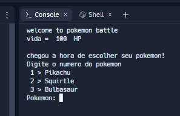
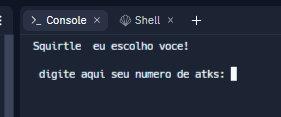
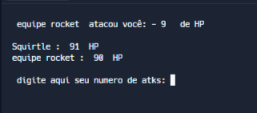

# ThePokemonBattle

### A Pokemon Battle in Python 

#### >> The first step to play game

#### >> Second step  

#### >> During the game

>> ###### you can view the code in:
>> [Code The Pokemon Battle](https://replit.com/@AnselmoLopes/PokemonBattle#main.py)